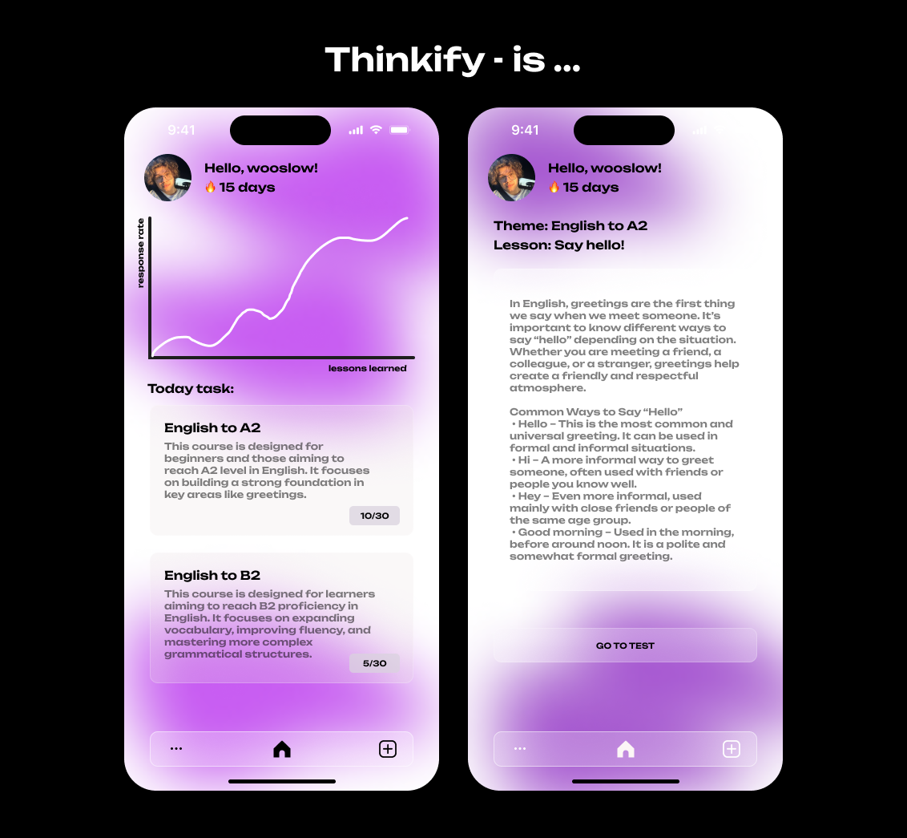

## ⚠️ This project was created during a Hackathon by EPAM x EHU in less than 10 hours
#### Due to this, the code may not be fully optimized and could contain some issues. The main goal was to deliver an MVP product.

--- 

# Thinkify 🤖

Thinkify is an AI-powered platform designed to help you learn any topic by providing personalized study materials, quizzes, progress tracking, and motivation through streaks.

## Features
- **Personalized Study Materials**: Thinkify provides you with personalized study materials based on your learning preferences and progress.
- **Quizzes**: Test your knowledge with quizzes and track your progress.
- **Progress Tracking**: Track your progress and see how much you've learned.
- **Streaks**: Stay motivated with streaks and earn rewards.
- **AI-powered**: Thinkify uses AI to provide you with the best learning experience.

## Tech Stack
- **Frontend**: Html, CSS, JavaScript by @edrdavid1
- **Backend**: Python, FastAPI, PostgreSQL, OpenAI API by @wooslow